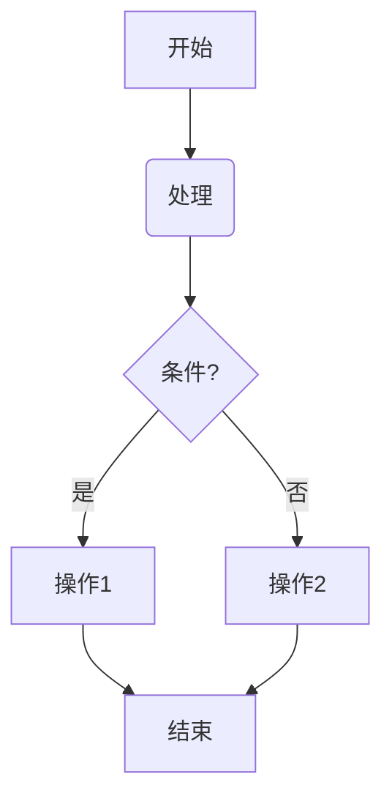

**语法速查表**

| 功能 (Feature) | Markdown 语法 (Syntax) | 效果预览 (Result) |
| :--- | :--- | :--- |
| 一级标题 | `# 标题内容` | 最大的标题 |
| 二级标题 | `## 标题内容` | |
| 三级标题 | `### 标题内容` | (依此类推，可到六级) |
| --- | --- | --- |
| **加粗** | `**需要加粗的文字**` | **需要加粗的文字** |
| *斜体* | `*需要倾斜的文字*` | *需要倾斜的文字* |
| ***加粗并斜体*** | `***又粗又斜的文字***` | ***又粗又斜的文字*** |
| ~~删除线~~ | `~~被删除的文字~~` | ~~被删除的文字~~ |
| --- | --- | --- |
| 无序列表 | `- 列表项` 或 `* 列表项` | • 列表项 |
| 有序列表 | `1. 列表项一`<br>`2. 列表项二` | 1. 列表项一<br>2. 列表项二 |
| 任务列表（待办） | `- [ ] 未完成的任务`<br>`- [x] 已完成的任务` | ☐ 未完成的任务<br>☑ 已完成的任务 |
| --- | --- | --- |
| > 引用 | `> 这是一段引用的文字` | > 这是一段引用的文字 |
| `行内代码` | `` `code` `` | 用于突出显示单个变量或命令 |
| 代码块 | ```` ```python `<br>`print("Hello, World!")`<br>` ``` ```` | 用于显示多行代码片段 |
| --- | --- | --- |
| 链接 | `[链接显示的文字](https://obsidian.md)` | [链接显示的文字](https://obsidian.md) |
| 图片 | `` | (在笔记中会直接显示图片) |
| 水平分割线 | `---` 或 `***` | 一条横跨整个页面的线 |


> [!note]+ 标题
> ```
> 注意：所有符号都是英文输入法下的符号
> 井号加空格，几个井号就是几级标题，一级标题字体最大。
> # 一级标题
> ## 二级标题
> ```

# 标题 1

## 标题 2

### 标题 3

#### 标题 4

##### 标题 5

###### 标题 6

---

> [!note]+ 文本
> ```
> 注意：所有符号都是英文输入法下的符号
> 两个星号是加粗：**我是加粗字体**
> 一个型号是斜体：*我是斜体*
> 三个星号，或者三个下划线是粗斜体：***我是粗斜体***，___我是粗斜体___
> 两个等号是高亮：==我是高亮==
> 两个波浪线是删除：~~我是删除~~
> ```

## 文本

普通文本

**段落粗体文本**

*段落斜体文本*

==高亮==

~~删除~~

***粗斜体***
___粗斜体___
~~删除~~


---

> [!note]+ 列表
> ```
> 注意：所有符号都是英文输入法下的符号
> 无序列表：减号/加号/星号 + 空格，三个符号哪个都可以，但是建议用减号。 - 列表项1
> 有序列表：数字+点+空格：1. 列表项
> 输入完一个列表项后，打回车可以继续下一个列表项
> 列表嵌套：使用tab可以让列表缩进，使用shift+tab可以取消缩进。
>
> 任务列表：方括号里面一个空格或者叉，空格代表未完成，叉代表已完成。
> [x] 任务 1
> [ ] 任务 2
> Task插件可以使已完成的任务后面自动显示完成时间。
>
>任务列表并非原始的、John Gruber 定义的 Markdown 标准语法。然而，它已经成为一种被广泛接受和支持的 Markdown 扩展语法，许多现代的 Markdown 编辑器和笔记应用也都采纳了这种任务列表语法，因为它非常直观和实用。
> ```
## 列表
**无序列表**
- 列表项 1
- 列表项 2
    - 列表项 2.1
    - 列表项 2.2
- 列表项 3

**有序列表**
1. 列表项 a
2. 列表项 b
    1. 列表项 b1
    2. 列表项 b2
3. 列表项 c

**任务列表**
- [ ] 任务 1
- [ ] 任务 2
    - [ ] 嵌套任务 2.1
    - [ ] 嵌套任务 2.2
- [ ] 任务 3

---

## 段落
> [!note]+ 段落
> ```
> 注意：所有符号都是英文输入法下的符号
> 引用：大于号+空格：> 我是引用
> 嵌套引用：多个大于号，每多一个大于号，代表深一层嵌套
> 分割线：三个减号然后回车：---
> 强制换行 (Soft Break / Line Break)：在同一段落内强制开始一个新行，而不是开始一个新段落。使用方法：在一行的末尾输入两个或更多的空格，然后按回车键。
> 备选方法：(如果 Markdown 解析器支持 HTML)：直接使用 HTML 的 <br> 标签。
> 
> ```

引用语法：
> 引用了一段名人名言
>> 嵌套引用
>>> 俄罗斯套娃

强制换行：

	这是第一行文字（假设末尾有两个空格）   
	第二行


分割线：

---

> [!note]+ 链接
> ```
> 注意：所有符号都是英文输入法下的符号
> [普通链接](https://www.bing.com/)
> [普通链接带标题](https://www.bing.com/ "普通链接带标题")
> 直接链接：<https://github.com>
> 锚点链接：1. 在文稿起草阶段，还没确定具体网址，但可以先给出网址标题。2. 同一篇文章需要重复出现同一个网址时.
> 使用方法：[网址标题][网址名]
> 然后在其他地方（一般是文章最后）给出网址名的地址：[网址名]:https://www.bing.com/
> [锚点链接][anchor-id]
> [anchor-id]: http://www.this-anchor-link.com/
> 
> ```

## 链接

[普通链接](https://www.bing.com/)

直接链接：<https://github.com>

[锚点链接][锚点名称123]

[锚点名称123]: http://www.this-anchor-link.com/


---
> [!note]+ 脚注
> ```
> 注意：所有符号都是英文输入法下的符号
> 方括号内，上箭头，外加脚注名称（一般为标号）
> 本句话要加脚注[^01]
> [^01]:这是解释脚注 01的内容
> ```

## 脚注

1. 要添加脚注的话[^01]
2. 第二个要添加脚注的话[^02]

[^01]:脚注内容一
[^02]:脚注内容二


---
> [!note]+ 图片
> ```
> 注意：所有符号都是英文输入法下的符号
> 图片语法与链接类似，只是在前面多一个感叹号!。
> 示例：
> 替代文本：当图片无法显示时展示的文字，也有助于屏幕阅读器。
> 图片路径：可以是网络图片的 URL，也可以是本地文件的相对或绝对路径。
> 可选的图片标题：鼠标悬停在图片上时显示的提示文字。
> 
> 带链接的图片 (Clickable Images)：
> 使用方法：将图片的 Markdown 语法作为链接的“链接文本”部分。
> [](链接地址)
> [](https://www.bing.com/)
> 点击即可跳转到bing.com，哪怕图片找不到，点击依然跳转到链接。
> ```
## 图片


[](https://www.bing.com/)


---

> [!note]+ 表格
> ```
> 注意：所有符号都是英文输入法下的符号
> 表头： 用竖线 | 分隔单元格内容。
> 分隔行： 用竖线 | 分隔，并使用至少三个减号 - 来创建每个单元格的分隔线。可以通过在减号前后添加冒号 : 来控制该列的对齐方式：
> 左对齐 (默认)：:--- (或 :-)
> 居中对齐：:---: (或 :-:)
> 右对齐：---: (或 -:)
> 内容行 (Content Rows): 用竖线 | 分隔单元格内容。
> 最外层的竖线 | 是可选的，但为了美观和清晰，建议加上。
> ```

## 表格

| 名字   | 姓氏    | 电子邮件                   |
| ------ | ------- | -------------------------- |
| John   | Doe     | john.doe@example.com       |
| Muffin | Poppies | muffin.poppies@example.com |
| Jane   | Doe     | jane.doe@example.com       |

| 左对齐 | 居中对齐 | 右对齐 |
| :----- | :------: | -----: |
| AAA    |   BBB    |    CCC |

---

> [!note]+ 代码
> ```
> 注意：所有符号都是英文输入法下的符号
> 行内代码用一个点包裹，代码块用三个点包裹，点是键盘上数字1左边的点。
> 代码块可以指定代码语言，比如python、javascript，直接加在三个点后面即可。
> 对于 Markdown 中的语言标识符（例如 javascript），通常不区分大小写。这意味着 javascript、JavaScript 和 JAVASCRIPT 应该产生相同的语法高亮效果。不过，最佳实践是使用小写形式。但这也可能取决于具体的 Markdown 解析器。
>
> Mermaid代码可以生成各种图标，感兴趣的可以单独学习Mermaid语法。
> ```

## 代码

**行内代码**
变量 `myvar` 被设置为值 `100`。

**代码块**


```python
import numpy as np
def calc(a):
	return np.sqrt(a)*3

test = calc(12)
```

Mermaid代码：



# [[Obsidian]]特有或增强的Markdown 功能

> [!note]+ 双链
> ```
> 注意：所有符号都是英文输入法下的符号
> 1. [[笔记文件名]]：链接到仓库内的另一篇笔记。使用方法：用双层方括号 [[]] 包裹笔记的文件名 (无需 .md 后缀)。示例：[[我的待办事项]]
> 2. [[笔记文件名#标题名]]：链接到另一篇笔记中的特定标题。使用方法：在文件名后加 # 和目标标题的文本。示例：[[Markdown 语法详解#10. 表格]]
> 3. [[笔记文件名|自定义显示文本]]：链接到另一篇笔记，但显示自定义的链接文字。使用方法：在文件名后加 | 和希望显示的文本。示例： [[2024-05-27 Daily Note|昨天的日记]]
> 4. ![[笔记文件名]]：将另一篇笔记的全部内容嵌入到当前笔记中。使用方法：与图片嵌入类似，但使用双层方括号，并以 ! 开头。示例： ![[常用代码片段]]
> 5. ![[笔记文件名#标题名]]：将另一篇笔记中特定标题下的内容嵌入。使用方法：在文件名后跟特定标题。示例： ![[会议记录#行动项]]
> 6. ![[笔记文件名#^块ID]]：嵌入笔记中被 \^块ID 标记的特定块（段落、列表项等）。使用方法：先在源笔记中，在你想要引用的段落或列表项的末尾添加一个块引用ID，格式为 ^yourBlockID (例如 ^task123)。然后在目标笔记中用 ![[源笔记文件名#^yourBlockID]] 来嵌入它。示例：在 "任务列表.md" 中： - [ ] 完成报告 ^reportTask，然后在当前笔记中嵌入： ![[任务列表#^reportTask]]
> ```
## 双链
注意：这里使用反斜杠，是为了让Obsidian不把他识别为一个双链，否则Dashboard就会被认为是一个双链，从而在关系图谱中看到这个Dashboard节点。
内部链接: \[[Dashboard]]

---
> [!note]+ 标签
> ```
> 注意：所有符号都是英文输入法下的符号
> 以井号 # 开头，后跟标签名称。标签名不能包含空格，可以用 - 或 _ 连接多词标签 (如 #读书笔记 或 #project-alpha)。标签可以放在笔记的任意位置，包括 YAML Frontmatter 中的 tags 字段。
> ```
## 标签
标签: #dashboard #notes

---

> [!note]+ 数学与公式
> ```
> 注意：所有符号都是英文输入法下的符号
> Obsidian 内置了对 KaTeX 的支持，用于渲染 LaTeX 数学公式。
> $行内数学公式$：将公式嵌入到文本行中。
> 使用方法：用一对美元符号 $ 包裹 LaTeX 公式。
> $$块级数学公式$$：将公式在单独的块中居中显示。
> 使用方法：两对美元符号包裹
> ```

## 数学与公式

$$g=g_0 \frac{R^2}{\left( R + z \right)^2} = \frac{g_0}{\left(1 + z/R \right)^2} $$

其中,
$g$ = 指定距离处的相对引力。
$g_0$ = \[[Surface Gravity |物体的表面引力]]。
$R$ = 物体的半径。(通常是物体的赤道半径)。
$z$ = 物体表面以上的距离。

---

> [!note]+ 引用块
> ```
> 注意：所有符号都是英文输入法下的符号
> 使用方法: 引用块 (>) 之后紧跟 [!类型]。类型可以是 note, abstract, info, todo, tip, success, question, warning, failure, danger, bug, example, quote 等。
> 可选标题**: 在 [!类型] 后可以添加自定义标题文本。
> 可折叠**: 在类型后加减号 - (如 [!INFO]-) 可使标注默认折叠，加加号 + (如 [!INFO]+) 可使其默认展开 (通常默认就是展开)。
> ```

## 引用块 (Callouts)

> [!note]+ 笔记引用块
> 这是一个笔记引用块...

> [!warning]- 警示引用块
> 这是一个警示引用块...